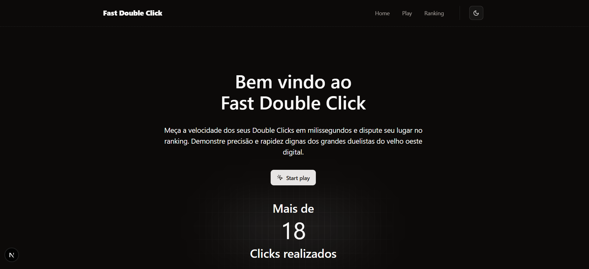
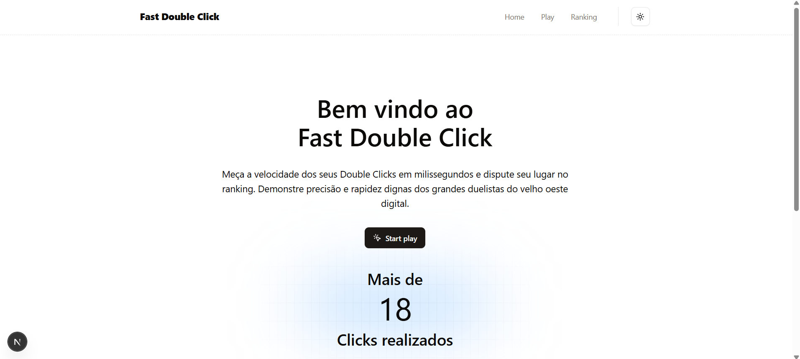

# Projeto Fast Double Click

## Tech Stack

- [TypeScript](https://www.typescriptlang.org)
- [Node](https://nodejs.org)
- [Fastify](https://fastify.dev/)
- [Vitest](https://vitest.dev/)
- [Zod](https://zod.dev/)
- [Tailwind](https://tailwindcss.com)
- [Shadcn UI](https://ui.shadcn.com/)
- [Lucide React](https://lucide.dev/)
- [Docker](https://www.docker.com/)

## Como rodar a aplicação

1. Clone o repositório:

   ```bash
   git clone https://github.com/RichardLirio/FastDoubleClick.git
   ```

2. Crie os arquivos `.env` **nas pastas `frontend` e `backend`**, seguindo os exemplos disponíveis no projeto.

3. Suba os containers com Docker Compose:

   ```bash
   docker compose up -d
   ```

# Back-end FastDoubleClick
  Repositorio criado para aplicação de um teste tecnico, a aplicação consiste em um mini game aonde é medido o tempo de um double click. O backend foi construído com foco em boas práticas de desenvolvimento, como os princípios SOLID,  e TDD (Test-Driven Development), utilizando Node.js, TypeScript, Fastify e zod para validações.


## Funcionalidades Principais

- **Inserção**: Cadastro de novos tempos dentro de um banco de dados local.
- **Busca**: Busca todos os registros de forma paginada e ordenada por melhores tempos.

## Tecnologias Utilizadas

- **Node.js**: Plataforma principal para o backend.
- **TypeScript**: Adiciona tipagem estática ao JavaScript para maior robustez.
- **Fastify**: Framework web leve e performático.
- **Zod**: Validação de esquemas para dados de entrada.
- **Vitest**: Ferramenta de testes unitários e end-to-end.

### Rotas Fastify:
  - `POST /clicks` → recebe e grava no JSON.
    ```json                 
    {
      "name": "Player1",
      "timeBetweenClicks": number // tempo entre os clicks
    }
  
  - `GET /clicks` → devolve lista de Clicks
  ```json
    [
      {
        "id": "uuid",
        "timestamp": "02/05/2025, 20:35:20",
        "name": "Player1",
        "timeBetweenClicks": 350
      }
    ]
  ```
  
  
## Banco de dados (JSON):
- Estrutura básica:
  
  ```json
  [
    {
      "id": "uuid",
      "timestamp": "02/05/2025, 20:35:20",
      "name": "Player1",
      "timeBetweenClicks": 350
    }
  ]
  
  ```
  
  - A aplicação utilizará um arquivo json emulando um banco de dados, e para isso precisei criar uma logica de funcionamento da seguinte maneira:
    - Primeiro ao iniciar o servidor ele verifica se o arquivo data.json já existe, caso não ele cria um arquivo novo:
      ```Typescript
      export async function FileExist(file: string) {
        const jsonHelpers = new JsonHelpers();
        try {
          await fs.access(file, fs.constants.F_OK);
        } catch (error) {
          await fs.mkdir("./src/data"); //cria pasta data caso não exista
          const saveFile = await jsonHelpers.write([]); //cria o arquivo json usado como banco de dados
          if (!saveFile) {
            throw new Error("Erro ao criar o arquivo Json.");
          } else {
            console.log("Arquivo Json Criado com sucesso.");
          }
        }
      }

    
    - Classe criada para manipulação do arquivo data.json:
      ```Typescript
        export class JsonHelpers {
        public filePath: string = "./src/data/data.json";
        //metodo para escrever no arquivo
        public async write(data: any): Promise<any> {
          try {
            await fs.writeFile(this.filePath, JSON.stringify(data, null, 2), "utf-8");
            return true;
          } catch (error) {
            console.error("🚀 ~ JsonHelpers ~ write ~ error:", error);
            return null;
          }
        }
        //metodo para inserir dados no arquivo
        public async insert(newClick: Clicks): Promise<Clicks | null> {
          try {
            const data = await this.read();
            if (!data) {
              return null;
            }
            data.push(newClick);
            await this.write(data);
            return newClick;
          } catch (error) {
            console.error("🚀 ~ JsonHelpers ~ update ~ error:", error);
            return null;
          }
        }
        //metodo para ler o arquivo
        public async read(): Promise<Clicks[] | null> {
          try {
            const data = JSON.parse(await fs.readFile(this.filePath, "utf-8"));
            return data;
          } catch (error) {
            console.error("🚀 ~ JsonHelpers ~ read ~ error:", error);
            return null;
          }
        }
        //metodo para zerar dados do arquivo
        public async delete(): Promise<any> {
          try {
            await this.write([]);
            return true;
          } catch (error) {
            console.error("🚀 ~ JsonHelpers ~ delete ~ error:", error);
            return null;
          }
        }
        }
    

Antes de começar, certifique-se de ter instalado:
- [Node.js](https://nodejs.org/) (versão 20 ou superior)
- [npm](https://www.npmjs.com/), [Yarn](https://yarnpkg.com/) ou [pnpm](https://pnpm.io/pt/)
- [Git](https://git-scm.com/)

## Como Configurar e Executar

Siga os passos abaixo para rodar a API localmente:

1. **Clone o Repositório**
   ```bash
   git clone https://github.com/RichardLirio/FastDoubleClick.git
   cd FastDoubleClick
   cd backend
   ```

2. **Instale as Dependências**
   ```bash
   pnpm install
   ```

3. **Configure as Variáveis de Ambiente**
   - Renomeie o arquivo `.env.example` para `.env`.
   - Preencha as variáveis necessárias, como:
     ```
     NODE_ENV=dev
     PORT=3333
     ```

4. **Inicie a API**
   ```bash
   npm run dev
   ```
   A API estará disponível em: `http://localhost:3333`.

## Testes

O projeto inclui testes unitários criados na aplicação do TDD

- **Rodar Testes Unitários**
  ```bash
  npm run test
  ```

# Front-end FastDoubleClick
### Visão Geral
O FastDoubleClick é um jogo que mede o tempo de reação entre dois cliques consecutivos. Desenvolvido com Next.js 15 e Tailwind CSS, o projeto oferece uma experiência moderna com dark mode, validações robustas e ranking de jogadores.

### Tecnologias Utilizadas
- Next.js 15 (App Router)

- TypeScript

- Tailwind CSS para estilização

- shadcn/ui para componentes UI

- Zod para validação de dados

- Sonner para notificações (toasts)

- Lucide React para ícones

### Funcionalidades Principais
- Registro de Tempos:
    - Medição precisa do intervalo entre dois cliques

 - Validação do nome do jogador

 - Envio dos dados para o backend

 - Ranking:
    - Listagem ordenada por melhores tempos

 - Filtragem por nome do jogador

 - Visualização em dark/light mode

### UI/UX
 - Componentes acessíveis e estilizados

 - Feedback visual durante interações

 - Notificações para ações do usuário

### 🧠 Lógica de Negócio Para Registro e Envio do Tempo para o Backend
- Arquivo form-play.tsx
- Implementa a lógica principal de medição e registro de tempos:

```typescript
Logica pensada e anotada no inicio do arquivo:
{
    /**
     Logica para registrar tempo entre os clicks:
    1) liberar somente o input para o usuario digitar seu nome, pois é obrigatorio no corpo da requisição.
    2) Assim que digitar o nome, habilitar o botão que irá realizar o registro do intervalo entre os dois clicks.
    2.1) Date.now() vs performance.now() -> utilizar o perfomance pois possui maior precisão.
    3) Salvar o intervalo e mostra-lo no seu input
    4) Assim que esse input do intervalo for alimentado, desabilitar o botão do double click e habilitar o botão responsavel pelo submit
    5) Ao realizar o submit zerar tudo e reiniciar a logica.
    **/
}

```


```typescript
Evento acionado pelo botão que vai receber o double click
// Trecho central da lógica de medição
  const handleClick = () => {
    const now = performance.now(); //performance melhor que o date now para registrar ms
    if (clickStart === null) {
      //verifica se o clickstart ja foi iniciado
      setClickStart(now); //seta caso não tenha sido iniciado
    } else {
      const diff = now - clickStart; //calcula o intervlo dos clicks
      setInterval(Math.round(diff)); //arredonda para inteiro
      setClickStart(null); //reseta o click inicial
      setClickEnabled(false); //desabilita o botão do double click
      setSubmitEnabled(true); //habilita o botão para envio dos dados
    }
  };
```
- Fluxo de Validação
- Schema Zod para validação:

```typescript
const registertimeBetweenClicksSchema = z.object({  
  name: z.string(),  
  timeBetweenClicks: z.coerce.number(),  
});

```


- Estados controlados:

```typescript
Variaveis utilizadas para registrar os tempos e executar as regras de negocio pensada.

const [name, setName] = useState("");
const [clickEnabled, setClickEnabled] = useState(false);
const [submitEnabled, setSubmitEnabled] = useState(false);
const [clickStart, setClickStart] = useState<number | null>(null);
const [interval, setInterval] = useState<number | null>(null);

```

### ▶️ Como Executar o Projeto
- ✅ Pré-requisitos:
    - Node.js 18+

    - npm ou yarn ou pnpm

### Backend precisa estar configurado e rodando (ver variáveis de ambiente)

### 💾 Instalação
```bash
git clone https://github.com/RichardLirio/FastDoubleClick.git
cd frontend

npm install

⚙️ Configuração
Crie um arquivo .env.local na raiz do projeto:

env
NEXT_PUBLIC_API_BASE_URL=http://localhost:3333
```

### 🚀 Execução
```bash
npm run dev
Acesse: http://localhost:3000

```

### 🔄 Fluxo do Usuário
- Acesse a página /play

- Digite seu nome

- Clique no botão "Realize um Fast Double Click"

- Execute dois cliques rápidos consecutivos

- Confirme o envio do tempo

- Veja sua posição no ranking em /ranking

👏 Projeto desenvolvido como desafio técnico por Richard Lirio.